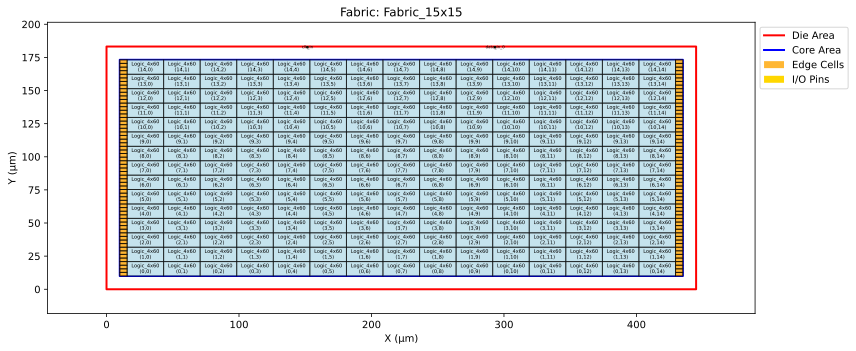

# fab1 
A simple fabric made out of 15x15 tiles. The tile design and the fabric design are given graphically below:

To generate the fabric use: `python3 fab_gen.py  --output-dir fab1 sky130_hd.json tiles.json fabric.json`
