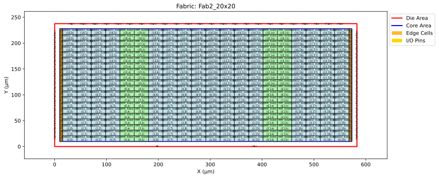
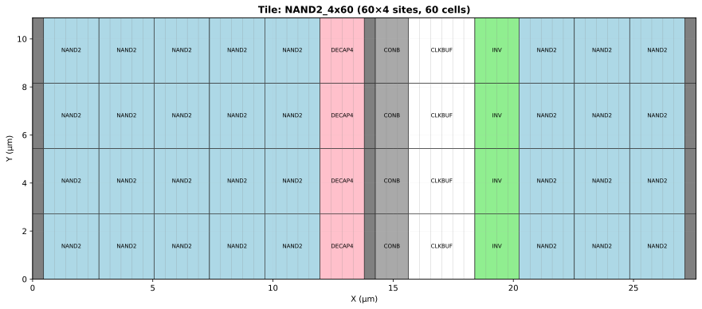
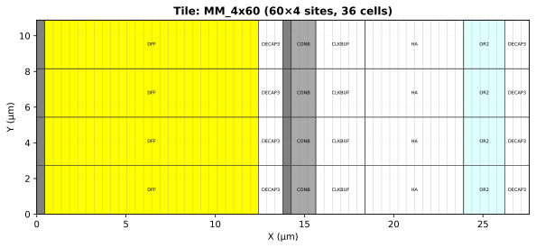

# fab 2
A 20x20 with mixed tiles. The tile design and the fabric design are given graphically below:
  
  
 
To generate the fabric use: `python3 fab_gen.py  --output-dir fab1 sky130_hd.json tiles.json fab2_20x20.json`
